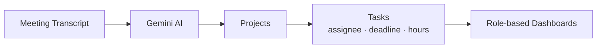

<div align="center">

# NovaWorks AI Project Manager

### From meeting transcript to a fully planned project, in one click.

**Built for THE INFINITY HACK '26 · 4th Position · Team Pokie Builders**


[Overview](#overview) · [Achievement](#achievement) · [Features](#features) · [Quick Start](#quick-start) · [Demo Accounts](#demo-accounts) · [Try the AI Flow](#try-the-ai-flow-in-2-minutes) · [Demo Video](#demo-video)

</div>

---

## Overview

Meetings produce decisions. Then everyone forgets who was supposed to do what.

**NovaWorks** is a meeting-to-execution project management CRM built for **NovaWorks Technologies**. Paste in a meeting transcript, and AI turns it into structured **projects** and **tasks**, complete with **assignees, deadlines, and estimated hours**.

Everyone gets a dashboard that matches their role: **Admins** see everything, **Managers** see their projects, and **Agents** see their own tasks.



---

## Achievement

This project was built during **THE INFINITY HACK '26** hackathon, organized by **Infinity Wave** at **COMSATS University Islamabad, Lahore Campus**.

**Our team secured 4th position** in the competition.

---

## Features

| Feature | What it does |
|---|---|
| **AI Transcript to Projects & Tasks** | Gemini reads a meeting transcript and generates projects and tasks automatically |
| **Deadlines & Estimated Hours** | Every task comes with a due date and a time estimate |
| **Secure Login** | Pre-seeded demo accounts, HTTP-only session cookies, PBKDF2 password hashing |
| **Role-Based Access Control** | Admin, Manager, and Agent roles, enforced on the **server**, not just hidden in the UI |
| **Team Directory** | See everyone on the team in one place |
| **Project & Task Management** | Browse projects and drill into their tasks |
| **Persistent Data** | Your data survives refreshes and restarts (local JSON database with atomic writes) |

---

## Who Sees What?

| Role | Projects | Tasks | Team Directory | Create from Transcript |
|---|:---:|:---:|:---:|:---:|
| **Admin** | All | All | Yes | Yes |
| **Manager** | Only assigned | Tasks in those projects | No | No |
| **Agent** | Related project info | Only assigned tasks | No | No |

> Access rules are enforced by the backend, so they can't be bypassed from the browser.

---

## Tech Stack

| Layer | Technology |
|---|---|
| **Frontend** | React 19, TypeScript, Vite, Tailwind CSS, Lucide React, Motion |
| **Backend** | Node.js, Express.js, TypeScript, `tsx` |
| **AI** | Google GenAI SDK with Gemini |
| **Auth** | HTTP-only session cookies + PBKDF2 password hashing |
| **Database** | Persistent local JSON file with atomic writes |

---

## Quick Start

### Prerequisites

- **Node.js 20+** and **npm**
- A **Google Gemini API key** (needed for the AI transcript feature)

### 1. Install dependencies

```bash
npm install
```

### 2. Set up your environment file

**Windows (PowerShell):**
```powershell
Copy-Item .env.example .env
```

**macOS / Linux:**
```bash
cp .env.example .env
```

Then open `.env` and paste in your own Gemini API key.

### 3. Run the app

```bash
npm run dev
```

Open **http://localhost:3000**

<details>
<summary><b>Other useful commands</b></summary>

```bash
npm run build   # Build for production
npm start       # Start the production build
npm run lint    # Type-check the project
```

</details>

### Environment Variables

```env
GEMINI_API_KEY=your-gemini-api-key
PORT=3000
NODE_ENV=development
```

| Variable | Required | Description |
|---|:---:|---|
| `GEMINI_API_KEY` | Yes | Powers the AI transcript processing |
| `PORT` | No | Server port (defaults to `3000`) |
| `NODE_ENV` | No | Use `development` locally |
| `APP_URL` | No | Reserved for hosted setups (no hosted deployment is configured yet) |

> **Warning:** Never commit your `.env` file or share a real API key.

---

## Demo Accounts

All demo accounts are fictional and share one password:

```
Password: Demo123!
```

| Name | Email | Role |
|---|---|---|
| Admin | `admin@novaworks.example` | Administrator |
| Ayesha Khan | `ayesha@novaworks.example` | Manager |
| Bilal Ahmed | `bilal@novaworks.example` | Manager |
| Hina Malik | `hina@novaworks.example` | Manager |
| Ali Raza | `ali@novaworks.example` | Agent |
| Hamza Shah | `hamza@novaworks.example` | Agent |
| Sara Noor | `sara@novaworks.example` | Agent |
| Usman Tariq | `usman@novaworks.example` | Agent |
| Zain Abbas | `zain@novaworks.example` | Agent |
| Maryam Asif | `maryam@novaworks.example` | Agent |

Accounts are created automatically the first time the app starts.

---

## Try the AI Flow in 2 Minutes

1. Run `npm run dev` and open **http://localhost:3000**
2. Log in as **Admin** (`admin@novaworks.example` / `Demo123!`)
3. Open **Create from Transcript**
4. Choose **1. Official Supplied Transcript** (or paste your own)
5. Click **Create from Transcript** and let Gemini work
6. Open the new projects and inspect assignments, deadlines, and estimated hours
7. Log in as a **Manager** and an **Agent** to see how access changes
8. Refresh the page and confirm everything is still saved

> There's also a **Modified Transcript** preset, which proves the AI reacts to changed input rather than returning canned results.

### Expected Result

The official transcript should produce **3 projects** and **12 tasks**:

| Project | Tasks |
|---|:---:|
| UrbanCart Website | 4 |
| QuickServe Mobile App | 4 |
| HelpDeskPro AI Assistant | 4 |

---

## Project Structure

```
.
├── data/
│   └── novaworks.json        # Local persistent database
├── server/
│   ├── ai.ts                 # Gemini transcript processing
│   ├── crypto.ts             # Password hashing & verification
│   ├── db.ts                 # JSON database operations
│   └── seedData.ts           # Demo users & seed data
├── src/
│   ├── components/           # React UI components
│   ├── lib/
│   │   ├── api.ts            # Frontend API client
│   │   └── transcriptSamples.ts   # Official & modified demo transcripts
│   ├── types/                # Shared TypeScript types
│   ├── App.tsx               # Main application component
│   └── main.tsx              # Frontend entry point
├── server.ts                 # Express + Vite server entry point
├── package.json              # Scripts & dependencies
└── .env.example              # Environment variable template
```

---

## Known Limitations

These are intentionally outside the challenge scope:

- Sign up / registration
- Forgot password & password reset
- Cost calculation & invoicing
- Progress monitoring & timesheets
- Real-time notifications
- Production-scale, multi-user database infrastructure

---

## Deployment

No live deployment is configured. This submission runs as a local demo at **http://localhost:3000** and stores data in `data/novaworks.json`. No hosted database is used.

---

## Demo Video

**[Watch the demo video here](https://drive.google.com/drive/folders/1CtcwIEHagLc1E7pFcn6JdfqNiB8SiCuz)**

---

## Team

**Team Pokie Builders** (4th Position, THE INFINITY HACK '26)

| Member | Role |
|---|---|
| **Taha Nadeem** | Team Leader |
| **Waqar Imran** | Team Member |
| **Ahad Ata** | Team Member |
| **Ahmer Ijaz** | Team Member |

<div align="center">

---

Made with care for **THE INFINITY HACK '26**

If you like this project, give it a star.

</div>
